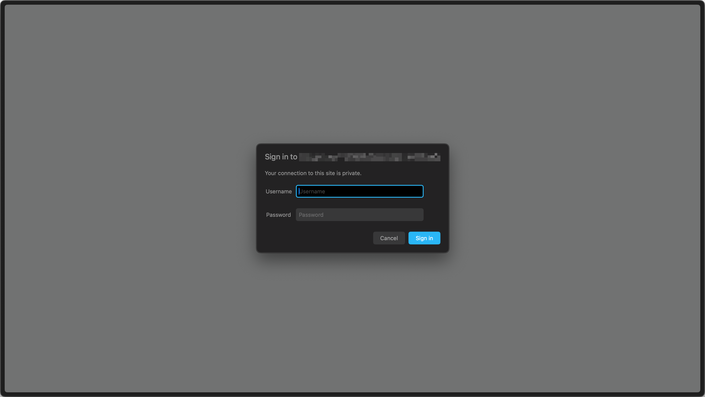
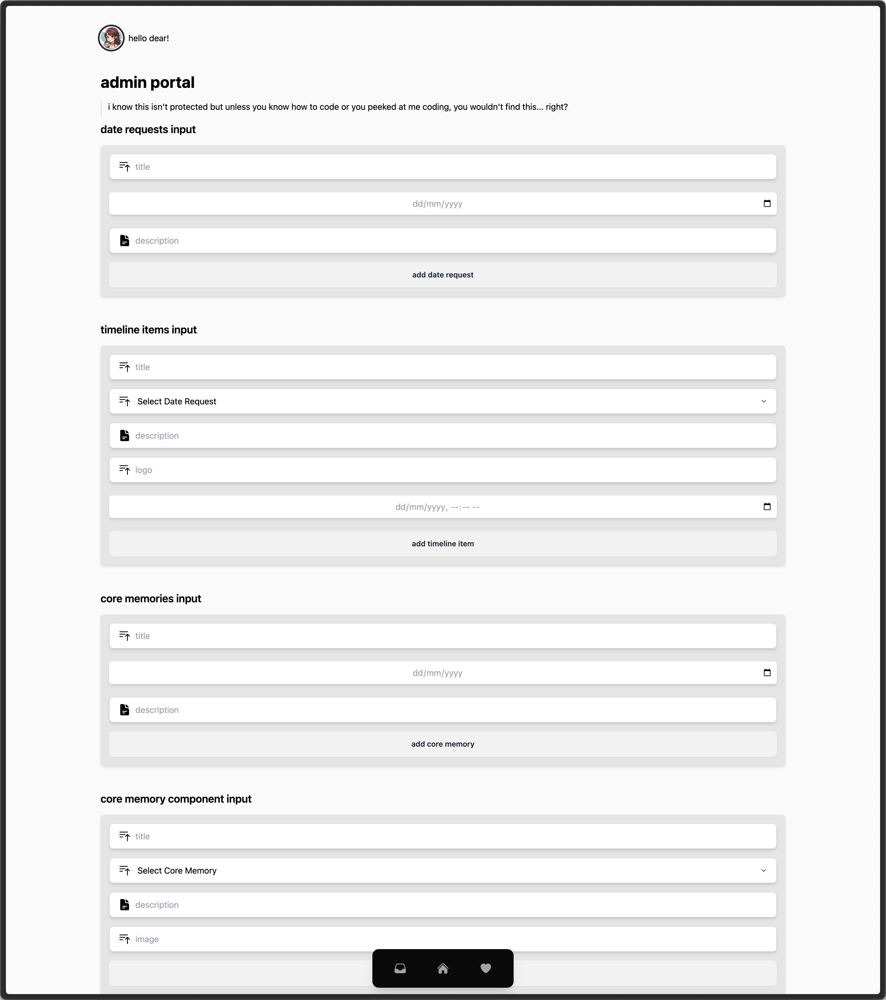
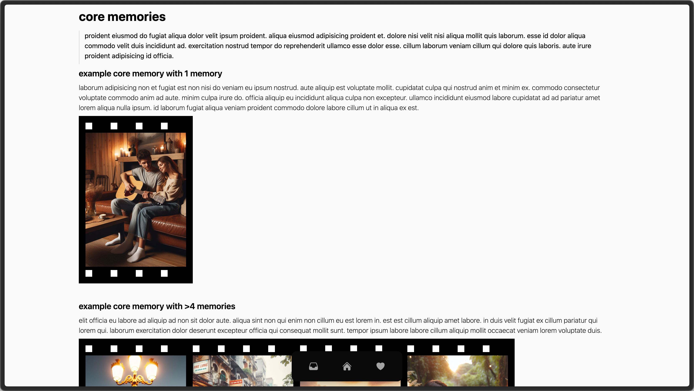
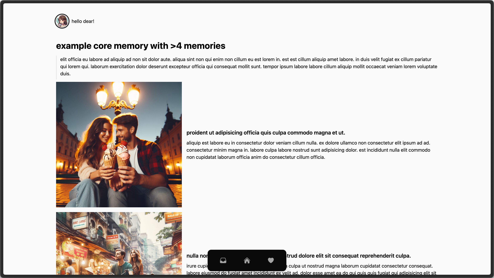
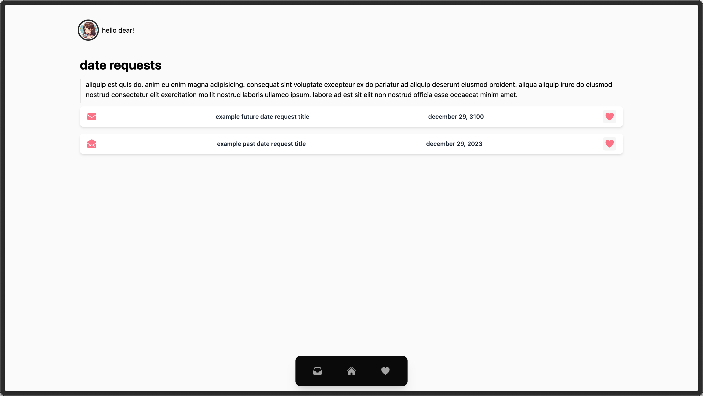
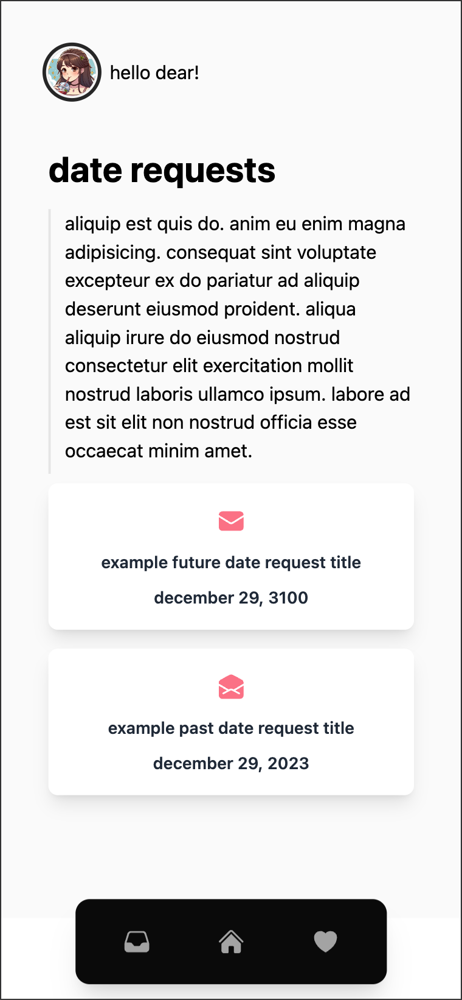
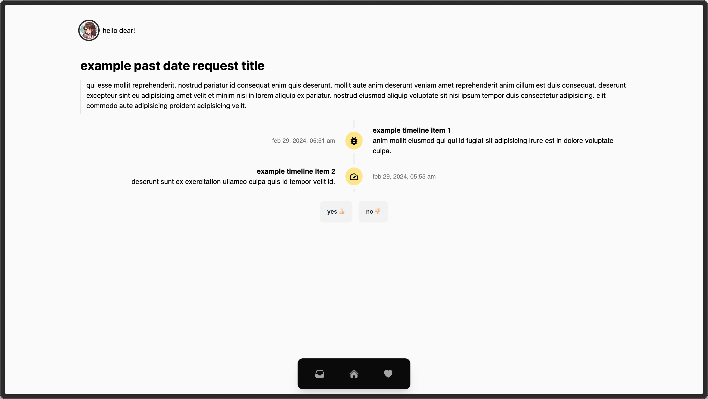
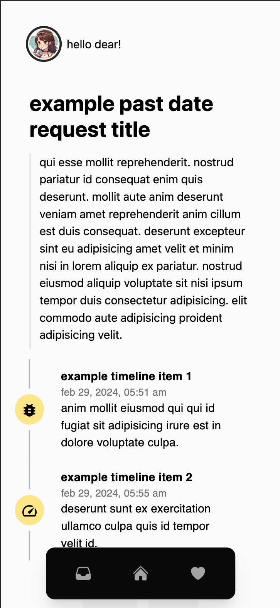

<!-- Improved compatibility of back to top link: See: https://github.com/othneildrew/Best-README-Template/pull/73 -->

<a name="readme-top"></a>

<!--
*** Thanks for checking out the Best-README-Template. If you have a suggestion
*** that would make this better, please fork the repo and create a pull request
*** or simply open an issue with the tag "enhancement".
*** Don't forget to give the project a star!
*** Thanks again! Now go create something AMAZING! :D
-->

<!-- PROJECT SHIELDS -->
<!--
*** I'm using markdown "reference style" links for readability.
*** Reference links are enclosed in brackets [ ] instead of parentheses ( ).
*** See the bottom of this document for the declaration of the reference variables
*** for contributors-url, forks-url, etc. This is an optional, concise syntax you may use.
*** https://www.markdownguide.org/basic-syntax/#reference-style-links
-->

[![Contributors][contributors-shield]][contributors-url]
[![Forks][forks-shield]][forks-url]
[![Stargazers][stars-shield]][stars-url]
[![Issues][issues-shield]][issues-url]
[![MIT License][license-shield]][license-url]
[![LinkedIn][linkedin-shield]][linkedin-url]

<!-- PROJECT LOGO -->
<br />
<div align="center">
  <a href="https://github.com/javianng/memories-hub">
    
  </a>

<h3 align="center">MemoriesHub</h3>

  <p align="center">
    MemoryHub is a personalized digital memory repository designed to capture and cherish the moments spent with your partner. It serves as a thoughtful gift, enabling users to curate date itineraries and store images accompanied by text descriptions, ensuring that every precious moment is preserved and easily accessible.
    <br />
    <a href="https://github.com/javianng/memories-hub"><strong>Explore the docs »</strong></a>
    <br />
    <br />
    <a href="https://github.com/javianng/memories-hub">View Demo</a>
    ·
    <a href="https://github.com/javianng/memories-hub/issues">Report Bug</a>
    ·
    <a href="https://github.com/javianng/memories-hub/issues">Request Feature</a>
  </p>
</div>

<!-- TABLE OF CONTENTS -->
<details>
  <summary>Table of Contents</summary>
  <ol>
    <li>
      <a href="#about-the-project">About The Project</a>
      <ul>
        <li><a href="#built-with">Built With</a></li>
      </ul>
    </li>
    <li>
      <a href="#getting-started">Getting Started</a>
      <ul>
        <li><a href="#prerequisites">Prerequisites</a></li>
        <li><a href="#installation">Installation</a></li>
      </ul>
    </li>
    <li><a href="#usage">Usage</a></li>
    <li><a href="#roadmap">Roadmap</a></li>
    <li><a href="#license">License</a></li>
    <li><a href="#contact">Contact</a></li>
    <li><a href="#acknowledgments">Acknowledgments</a></li>
  </ol>
</details>

<!-- ABOUT THE PROJECT -->

## About The Project


<p align="right">(<a href="#readme-top">back to top</a>)</p>

### Built With

- [![Next][Next.js]][Next-url]
- [![React][React.js]][React-url]
- [![tailwindCSS][tailwindCSS-shield]][tailwindCSS-url]
- [![materialUi][materialUi-shield]][materialUi-url]
- [![daisyUi][daisyUi-shield]][daisyUi-url]
- [![planetscale][planetscale-shield]][planetscale-url]
- [![trpc][trpc-shield]][trpc-url]
- [![firebase][firebase-shield]][firebase-url]

<p align="right">(<a href="#readme-top">back to top</a>)</p>

<!-- GETTING STARTED -->

## Getting Started

To access the deployed / preview, use the following credentials.

- Username: user
- Password: password

To get a local copy up and running follow these simple steps.

### Prerequisites

- Set up a firebase application.
- Set up a planetscale account and database.

### Installation

1. Clone the repo
   ```sh
   git clone https://github.com/javianng/memories-hub.git
   ```
2. Install NPM packages
   ```sh
   npm install
   ```
3. Enter your API in `.env`. You can copy and use the `.env.example` provided wiht your own api keys.
4. In `admin.tsx`, uncomment the codes that are commented out and remove the existing button code.

<p align="right">(<a href="#readme-top">back to top</a>)</p>

<!-- USAGE EXAMPLES -->

## Usage

### Edge Middleware



### Admin Portal



- To allow you to add Core Memories and Date Requests and their components.
- Access by going to the .../admin url.
- Disabled by default to prevent my deployed page to be amended.

### Core Memories Home Page



- Filmstrip aesthetic that links to a dynamic page for each memory

### Core Memory Individual Page



### Date Request Home Page




### Date Request Individual Page




<p align="right">(<a href="#readme-top">back to top</a>)</p>

<!-- ROADMAP -->

## Roadmap

- [x] Full stack application created.
- [ ] Firebase upload in admin portal.

See the [open issues](https://github.com/javianng/memories-hub/issues) for a full list of proposed features (and known issues).

<p align="right">(<a href="#readme-top">back to top</a>)</p>

<!-- LICENSE -->

## License

Distributed under the MIT License. See `LICENSE.txt` for more information.

<p align="right">(<a href="#readme-top">back to top</a>)</p>

<!-- CONTACT -->

## Contact

Javian Ng - [@j_avianzz](https://twitter.com/j_avianzz) - javian.ng.z.h@gmail.com

Project Link: [https://github.com/javianng/memories-hub](https://github.com/javianng/memories-hub)

<p align="right">(<a href="#readme-top">back to top</a>)</p>

<!-- MARKDOWN LINKS & IMAGES -->
<!-- https://www.markdownguide.org/basic-syntax/#reference-style-links -->

[contributors-shield]: https://img.shields.io/github/contributors/javianng/memories-hub.svg?style=for-the-badge
[contributors-url]: https://github.com/javianng/memories-hub/graphs/contributors
[forks-shield]: https://img.shields.io/github/forks/javianng/memories-hub.svg?style=for-the-badge
[forks-url]: https://github.com/javianng/memories-hub/network/members
[stars-shield]: https://img.shields.io/github/stars/javianng/memories-hub.svg?style=for-the-badge
[stars-url]: https://github.com/javianng/memories-hub/stargazers
[issues-shield]: https://img.shields.io/github/issues/javianng/memories-hub.svg?style=for-the-badge
[issues-url]: https://github.com/javianng/memories-hub/issues
[license-shield]: https://img.shields.io/github/license/javianng/memories-hub.svg?style=for-the-badge
[license-url]: https://github.com/javianng/memories-hub/blob/master/LICENSE.txt
[linkedin-shield]: https://img.shields.io/badge/-LinkedIn-black.svg?style=for-the-badge&logo=linkedin&colorB=555
[linkedin-url]: https://linkedin.com/in/javianngzh
[product-screenshot]: images/screenshot.png
[Next.js]: https://img.shields.io/badge/next.js-000000?style=for-the-badge&logo=nextdotjs&logoColor=white
[Next-url]: https://nextjs.org/
[React.js]: https://img.shields.io/badge/React-20232A?style=for-the-badge&logo=react&logoColor=61DAFB
[React-url]: https://reactjs.org/
[tailwindCSS-shield]: https://img.shields.io/badge/tailwindcss-20232A?style=for-the-badge&logo=tailwindcss
[tailwindCSS-url]: https://tailwindcss.com/
[materialUi-shield]: https://img.shields.io/badge/mui-20232A?style=for-the-badge&logo=mui
[materialUi-url]: https://tailwindcss.com/
[daisyUi-shield]: https://img.shields.io/badge/daisyui-20232A?style=for-the-badge&logo=daisyui
[daisyUi-url]: https://daisyui.com/
[planetscale-shield]: https://img.shields.io/badge/planetscale-20232A?style=for-the-badge&logo=planetscale
[planetscale-url]: https://planetscale.com/
[trpc-shield]: https://img.shields.io/badge/trpc-20232A?style=for-the-badge&logo=trpc
[trpc-url]: https://trpc.io/
[firebase-shield]: https://img.shields.io/badge/firebase-20232A?style=for-the-badge&logo=firebase
[firebase-url]: https://firebase.google.com/
